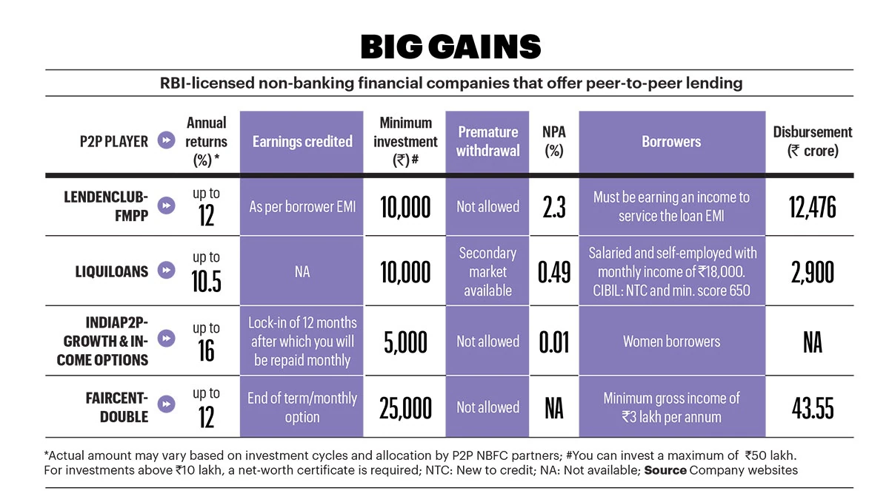

## P2P Lending Market Analysis


### Introduction

The P2P lending market on rise, According to a report by IndustryARC, a market research firm, 
the Indian P2P lending market is expected to swell to $10.5 billion by 2026, growing at 21.6 per 
cent between 2021 and 2026.

P2P lending is a form of crowd-funding used to raise loans which are paid back with interest.
It can be defined as the use of an online platform that matches lenders with borrowers in order
to provide unsecured loans. It can be seen as a form of crowd-sourcing or microfinance.





## Problem Statement
The problem with P2P is no central authority to regulate the market, so the risk of fraud is high.
And geniune lenders need to be protected from fraud borrowers. So, we need to understand the 
factors that affect the chances of defaults, how can a genuine lender take an informed decision
to lend money to a borrower. 

## Data

The data we have taken is from LendingClub.com, the data is openly available, the 
potential idetifier variable of a person not given, neither tend to be used in this 
project to keep an unibiased approach, and also respecting the privacy of the person.

### Data Description

1. credit.policy: 1 if the customer meets the credit underwriting criteria of LendingClub.com, and 0 otherwise. 
2. purpose: The purpose of the loan (takes values "credit_card", "debt_consolidation", "educational", "major_purchase", "small_business", and "all_other"). 
3. int.rate: The interest rate of the loan, as a proportion (a rate of 11% would be stored as 0.11). Borrowers judged by LendingClub.com to be more risky are assigned higher interest rates. 
4. installment: The monthly installments owed by the borrower if the loan is funded. 
5. log.annual.inc: The natural log of the self-reported annual income of the borrower. 
6. dti: The debt-to-income ratio of the borrower (amount of debt divided by annual income). 
7. fico: The FICO credit score of the borrower. 
8. days.with.cr.line: The number of days the borrower has had a credit line. 
9. revol.bal: The borrower's revolving balance (amount unpaid at the end of the credit card billing cycle). 
10. revol.util: The borrower's revolving line utilization rate (the amount of the credit line used relative to total credit available). 
11. inq.last.6mths: The borrower's number of inquiries by creditors in the last 6 months. 
12. delinq.2yrs: The number of times the borrower had been 30+ days past due on a payment in the past 2 years. 
13. pub.rec: The borrower's number of derogatory public records (bankruptcy filings, tax liens, or judgments).

credit.policy is internally used by lending club to decide whether to give loan to a person or not
we are considering this as our target variable, and representation of defaulters, whereas it signifies
potential defaulters, but since human have categorised it, we consider it as defaulters and non-defaulters
signifying 1 and 0 respectively, We understand that the human may make an error in judgement, but considering
the project, even if we consider it as a error, we can't do anything about it, As like as ImageNet dataset
has some errors in labelling, but we can't do anything about it, we have to work with it.


## To Run the Project

1. Clone the repository
```dockerignore
git clone { this repo.git}
```

2. Change the directory
```dockerignore
cd {this repo}
```

3. Install the requirements
```dockerignore
pip install -r requirements.txt
```

4. Run the code
```dockerignore
python main.py
```

The code will run and the output will be saved in the output folder.


## Conclusion

1. `Higher the interest rate offered by a borowwer higher the chances of default.` : This may be due to the bad reputation of the borrower, or the borrower is not able to pay the interest rate, so he/she is taking loan from P2P lending market, which is not a good sign for the lender.
2. `Higher the FICO score of the borrower, lower the chances of default.` : This is a good sign for the lender, as the borrower has a good credit score, so he/she is more likely to pay the loan back.
3. `Higher the credit score, lower is the interest rate offered by the borrower.` : This signifies demand and supply, as the borrower has a good credit score, he/she is more likely to pay the loan back, so more lenders are willing to lend money to the borrower, so the borrower can negotiate the interest rate.
4. `The purpose of loan shows have some interesting finding and need more evaluation.` : The purpose of loan shows some interesting findings, education have the higher percentage of defaulters, also purpose is one of the important feature as seen in logistic regression, to be statistically sound,further investigation is needed on different datasets.
5. ` 20% of the borrowers are potential defaulters.` : This is a good sign for the P2P lending market, as the defaulters are less , so the market is growing, and the lenders are getting their money back.
6. ` The person who have fully paid their earlier loans are more likely to pay the loan back.` : This is a good sign for the lender, as the borrower has a good credit score, so he/she is more likely to pay the loan back.
7. `The borowwer who are enquired often are more likely to default.` : This may be due to the fact that the borrower is not able to pay the loan back, so he/she is enquiring often, or the borrower is not able to get the loan, so he/she is enquiring often, which is not a good sign for the lender.


## Acknowledgements

1. [Lending Club](https://www.lendingclub.com/) : For the dataset
2. [Python](https://www.python.org/) : For the language
3. [Pandas](https://pandas.pydata.org/) : For the data manipulation
4. [Matplotlib](https://matplotlib.org/) : For the visualisation
5. [Seaborn](https://seaborn.pydata.org/) : For the visualisation
6. [statsmodels](https://www.statsmodels.org/stable/index.html) : For the statistical analysis


